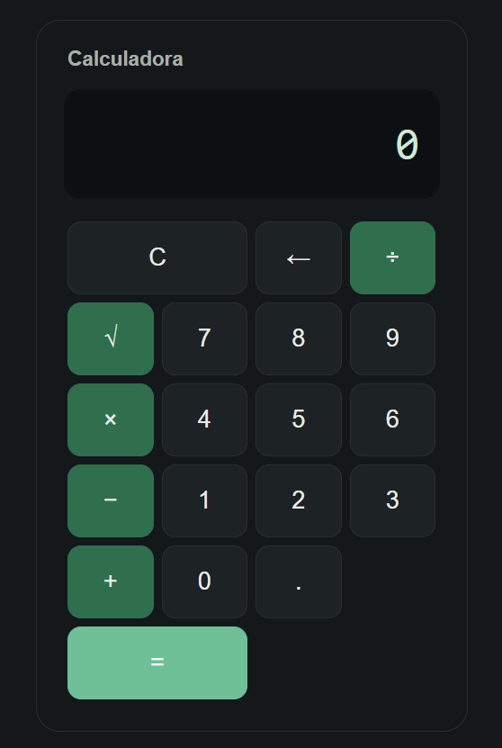
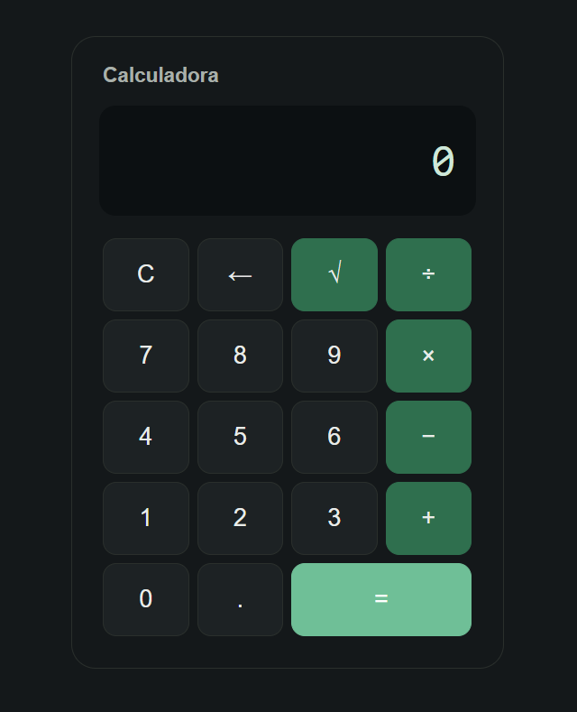

# Calculadora Web - Rama: `raiz-cuadrada`

Este documento resume los cambios, mejoras visuales y validaciones implementadas para la funcionalidad de **Raíz Cuadrada (`√`)**.

---

## 1. Comparativa Visual (Antes vs. Después)

| Versión Anterior | Versión Corregida |
| :---: | :---: |
|  |  |
| **Problema:** El botón `C` ocupaba 2 espacios, empujando los operadores y desfasando la cuadrícula a 6 filas irregulares. | **Solución:** Se ajustó `C` a 1 columna y se integró `√` en la fila superior, logrando una cuadrícula uniforme de 4 columnas. |

---

## 2. Resumen de Cambios

### A. Interfaz y Distribución de Teclas (HTML)
- **Ubicación de `√`:** Se integró el botón `<button class="operador" onclick="calcularRaiz()">√</button>` en la primera fila.
- **Alineación de Cuadrícula:** Al retirar la clase `.doble` del botón `C`, la fila 1 quedó formada por 4 teclas (`C`, `←`, `√`, `÷`), manteniendo las 5 filas uniformes.

### B. Función de Raíz Cuadrada (`calcularRaiz`)
- Evalúa la expresión ingresada y aplica `Math.sqrt()`.
- Valida que no se calculen raíces reales de números negativos (muestra `Error`).

### C. Validaciones Implementadas
1. **Control de ceros a la izquierda (`agregarDigito`):**
   - Evita la acumulación de ceros repetidos (`00` permanece en `0`).
   - Corrige números con cero por delante (ej. pulsar `0` y luego `5` escribe directamente `5`).
   - Permite números decimales como `0.`.
2. **Prevención de desbordamiento de decimales:**
   - Redondeo a un máximo de **14 dígitos** (`parseFloat(resultado.toFixed(14))`) tanto en `calcular()` como en `calcularRaiz()`.
   - Evita que resultados largos desborden la pantalla y corrige imprecisiones de punto flotante.
